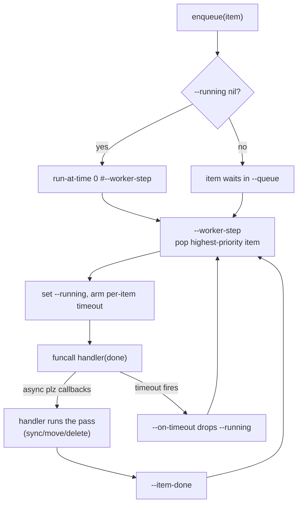

# AGENTS.md — orientation for AI assistants and contributors

This file gives an AI agent (or new human contributor) what they need to make safe, idiomatic changes to this package without re-deriving the architecture. End-user docs are in `README.md`.

## At a glance

Pure-Elisp two-way sync between org-mode and Google Tasks. Triggered by an Emacs timer + `after-save-hook`. Last-write-wins with conflict quarantine. Auto-delete in both directions. Single Google account, single subtree per list. `position` sync via `tasks.move` is driven by advice on org's own `M-↑`/`M-↓`/`M-←`/`M-→` keys (server-first, no race). DONE handling is configurable via `org-mode-google-tasks-sync-keep-done-items`.

## Use Nix when it's available

If `command -v nix` succeeds, **prefer `nix develop --command ...` for every Emacs invocation** (running tests, byte-compiling, exploring the package in a REPL, anything that needs `plz` or `oauth2`). The dev shell guarantees the deps are on the load-path and avoids touching `test/.elpa/` or the user's `~/.emacs.d`.

Quick reference:

```sh
nix develop --command emacs --batch -l test/run-tests.el -f ert-run-tests-batch-and-exit
nix develop --command emacs --batch -L . -f batch-byte-compile *.el
nix flake check                                            # fully sandboxed CI-equivalent run
nix build .#default                                        # produce the byte-compiled package
```

Fall back to plain `emacs` only when Nix isn't installed — the test helper handles that case by installing deps into `test/.elpa/`.

## Module map

| File | Responsibility |
|---|---|
| `org-mode-google-tasks-sync.el` | Entry point. Autoloads, `defcustom`s, public interactive commands, global minor mode. Has no logic of its own beyond timer/hook plumbing. |
| `org-mode-google-tasks-sync-oauth.el` | Reads/writes `client_id`, `client_secret`, `refresh_token` via `auth-source`. Loopback HTTP server (`make-network-process` with `:host 'local :service t`). Token refresh via the Google token endpoint. |
| `org-mode-google-tasks-sync-api.el` | `plz`-based wrappers for the Tasks API endpoints: `tasks.tasklists.list`, `tasks.tasks.list/get/insert/patch/delete`. Pagination via `nextPageToken`. JSON via native `json-parse-string` / `json-serialize`. **Transient-error retry** is here too: `--with-retry` wraps every call, classifying plz errors via `--retry-classify` (429/5xx/curl-6/7/28/35/52/56 → `:retry`; 412 → `:412`; anything else → nil) and re-firing the request after a jittered delay via `run-at-time`. |
| `org-mode-google-tasks-sync-org.el` | Reads/writes a Google Task as an org heading. Defines the `org-mode-google-tasks-sync-org-task` struct. Computes the canonical content hash. Pure functions over the buffer at point. No network. |
| `org-mode-google-tasks-sync-engine.el` | Reconciliation.  The 4-cell conflict matrix.  Quarantine buffer.  Log buffer.  Action queue + worker (`--queue`/`--running`/`--worker-step`): the single main-thread driver that serializes sync/move/delete items (dedup per key, priority class, per-item timeout).  Post-apply children sort by `:GTASK_POSITION:` / `:GTASK_COMPLETED:` (TODOs by position asc, DONEs by completed desc), gated by `--sort-needed-p` and bounded by `--sort-with-budget` (invariant 21). |

The entry-point file also hosts buffer-local view/edit features: the
`hide-done-mode` minor mode (invisibility overlays keyed by
`org-mode-google-tasks-sync--hide-done-spec`, hooked to
`org-after-todo-state-change-hook`), the `delete-at-point` /
`show-trash` / `restore-at-point` trio that goes through the trash
buffer (`*org-mode-google-tasks-sync-trash*`, optionally persisted to
`$XDG_DATA_HOME/org-mode-google-tasks-sync/trash.org`), the
`new-task` convenience prompt, and the `jump-to-list` command that
switches to any reachable configured task list (auto-jump on a
single list, fuzzy `completing-read` otherwise; gated on
`org-mode-google-tasks-sync-debug-jump-always-prompt`).  These call
into the engine and API client but don't change the state machine.

`test/` contains `ert` suites and a `test-helper.el` that installs `plz` + `oauth2` into a project-local `.elpa` so the user's `~/.emacs.d` is never touched. `test/integration/` contains integration tests that drive the full engine against a Mockoon mock server (see "Running tests" below).

## Key invariants

These hold throughout the codebase. Violating them produces silent data loss or sync loops, so flag any change that touches them.

1. **The server's `updated` field is authoritative** for "did remote change?" — never compare local wall-clock time to server time. Local clock is only used for the loser-tiebreak in a both-sides-changed conflict.
2. **The canonical content hash includes title, notes, status, due — and nothing else.** Not the GTASK_ID, etag, updated, hash itself, list-id, priority cookie, **position, completed timestamp, links, or webViewLink**.  Position, completed, links, and webViewLink are display metadata; including them would cause Google-side reordering or completion-time bumps to surface as spurious "local changed" detections.  Adding fields to the hash is a breaking change for users with existing data (their stored hashes will mismatch and trigger spurious pushes).
3. **Property drawer values are read by `org-entry-get`, written by `org-entry-put`.** Never `re-search-forward` for `:GTASK_ID:` — that breaks if anyone reformats the drawer.
4. **All HTTP goes through `plz` with `:then`/`:else` callbacks.** Never `accept-process-output` to "wait" — that blocks the UI on the timer tick.
5. **All sync/move/delete work goes through the single action queue and its worker.** `org-mode-google-tasks-sync-engine--queue` holds pending items; `--running` is the item the worker is currently executing; `--worker-step` is the lazily-scheduled, at-most-one main-thread driver (`run-at-time 0` on enqueue, drained by completion callbacks). Item types: `move`/`delete` (dedup key = task-id; a newer `move` *replaces* a queued one for the same task), `incremental-sync`/`full-sync` (dedup key = the type symbol; coalesce). Priority class: interactive (`move`/`delete`) ahead of `incremental-sync` ahead of `full-sync`. Each item gets its own per-item timeout (`--arm-timeout`) so a hung item is dropped and the worker advances instead of parking forever. The old `--state` idle/fetching/applying is a *derived view* of the worker for log/test continuity; the queue is the source of truth. Never call `tasks.move`/`tasks.delete` or fire a sync pass outside the queue — that re-introduces the move-vs-sort race that invariants 10/12/14–16 exist to manage.
6. **Priority cookies (`[#A]`/`[#B]`/`[#C]`) are stripped from titles on push and preserved on pull.** `org-mode-google-tasks-sync-org--replace-title` rewrites only the title portion of a headline, keeping the TODO keyword and any priority prefix.
6a. **Org tags ride the pushed title as trailing `@'-hashtags.** Google Tasks v1 has no tag field, so `--task->api-data` encodes `tags` as `title @tag1 @tag2` (sorted); `--remote-task->struct` decodes the contiguous trailing `@' run back into struct tags, and `write-task` applies them via `org-set-tags'.  Tags carrying whitespace are silently dropped on encode (spaces are the hashtag separator).  The canonical-hash projection passes through `--title-encode-tags', which leaves untagged titles byte-identical — preserves the no-spurious-push guarantee of invariant 2 across the upgrade.
7. **Direct children and one level of subtasks (2 levels max) are synced.** `collect-tasks-under` walks the subtree under the configured parent heading up to 2 levels deep. Headings at level 3+ are local-only. Each task's `parent-id` is inferred from the org heading hierarchy: `org-up-heading-safe` + `org-entry-get :GTASK_ID:`.  The *last-synced* parent is persisted separately as the `:GTASK_PARENT_ID:` property (see invariant in the property-keys convention); reparent resolution in `--reconcile-one` compares hierarchy vs. stored property to decide who moved.
8. **Secrets never get written directly to `~/.authinfo.gpg`.** Always go through `auth-source-search :create t` and call the returned `:save-function`. Bypassing this breaks the macOS Keychain / pass backends.
9. **DONE handling is gated on `org-mode-google-tasks-sync-keep-done-items`.** When nil (default), completed tasks are removed from the local buffer (with trash snapshot and conflict quarantine) instead of kept as DONE headings. The decision fast-paths in `org-mode-google-tasks-sync-engine--decide` (`done-remove-local`, `done-push-then-remove`) must run *before* the 4-cell conflict matrix. Conflict resolution still favors the remote side.
10. **Reorder/reparent advice is server-first and queue-serialized.** `M-↑`/`M-↓`/`M-←`/`M-→` enqueue a `move` item (via `--enqueue-move`) that calls `tasks.move` before moving the heading locally; the local move happens in the `:then` callback inside `inhibit-save-hooks`. Because moves run as their own queue items ahead of any in-flight sync, the post-apply `--sort-children` inside a sync can't race with the move's position write — the sort always sees the freshly-written `:GTASK_POSITION:` from the completed move response. Subtree-variant keys (`M-S-←`/`M-S-→`) are refused on synced headings.
11. **HTTP 412 (ETag conflict) is never blind-retried.** The API layer's `--with-retry` classifies 412 separately from `:retry` and hands it to the caller-supplied `on-412` hook (engine's `--finalize-push-etag-conflict`), which refetches the live task and applies remote-wins semantics: quarantine the local diff if content-changed, write the fresh copy, log, call the original on-success. Retryable errors (429, 500, 502, 503, 504, curl-6/7/28/35/52/56) are retried with full jitter ([BASE/2, BASE×2^attempt]) up to 3 total attempts; `Retry-After` overrides jitter when present (capped at 60 s).
12. **Async callbacks that write heading state must pin to a sticky marker and verify the heading hasn't been displaced.** `point-marker` is non-sticky: it stays at a byte offset, so when `--sort-children` relocates heading text the marker ends up pointing at a *different* heading.  The advice functions (`--advised-move`/`--advised-promote`/`--advised-demote`) and the push callbacks (`--push-new`/`--push-update`/`--finalize-push-etag-conflict`) capture markers via `--sticky-marker` (`set-marker-insertion-type t`) and pass them as `HEADING-MARKER` to `--apply-server-move`/`--write-task-if-marker-matches`.  `--update-heading-server-state` goto-chars the marker before writing `GTASK_UPDATED`/`GTASK_ETAG`/`GTASK_POSITION`, and `--refresh-content-hash-at` recomputes `GTASK_CONTENT_HASH` at the marker — preventing a phantom pull that would reorder the heading back to its pre-move position.
13. **Hidden tasks are treated as deleted, independent of `keep-done-items`.** A task with `hidden=true` on the server (set by the Google Tasks UI's "Clear completed tasks") is filtered out of the live remote set in `--apply` *before* reconciliation.  Any local heading whose `GTASK_ID` matches a hidden task is removed via `--delete-local` with reason `hidden-archived` (trash-snapshotted; restore creates a fresh task because the original is unreachable on the server).  This runs in both `incremental` and `full` modes.  **Never** confuse `hidden` with `keep-done-items`: the former is server-side archival; the latter is a local display preference.
14. **New-task pushes are serialized depth-first via `--push-new-queue`.** When multiple new tasks are inserted in a single tick, each `tasks.insert` must complete (and write its `GTASK_ID` into the buffer) before the next fires — otherwise subtasks of new parents are pushed flat (no parent set) and all tasks land at position 0.  `--push-new-queue` processes tasks one at a time; `--resolve-parent-id` re-reads the parent's `GTASK_ID` from the buffer *at fire time* (not at snapshot time), so a freshly-created parent is found.  `--finalize-apply` runs only after the queue drains.  `--finalize-push-new` copies the full server-assigned metadata from the insert response — `id`, `updated`, `etag`, `position`, `completed`, `links`, `web-view-link` — into the struct before writing.  Copying `position` is essential: without it, `--sort-children` sees an empty position string and sorts the freshly-pushed heading to the wrong spot.  As a defensive backstop, `--compare-tasks` treats an empty position as sorting **last** among TODOs, not first — so even if a position write is skipped (e.g. marker detachment), the heading stays at the end of its siblings instead of jumping to the front.
15. **Duplicate `GTASK_POSITION` values are repaired via `tasks.move` before sorting.** Multiple synced tasks can end up with identical position strings (the primary cause was the pre-A1/A3 flat-push bug).  `--repair-position-ties` walks direct synced children, finds adjacent pairs with equal positions, and fires `tasks.move` with `previous=<first-id>` so Google assigns a unique position.  Runs after push-new completes but before `--sort-children`, so the sort sees unique positions and produces a stable order.  Recurses one level into each synced child's subtree — matching the 2-level sync depth of `collect-tasks-under` — so tie collisions among subtasks are repaired too.  Never rely on stable-sort to disambiguate ties — Google's position strings are opaque and collisions are real.
16. **Manual cut/paste reorders are detected via a drift snapshot taken at tick start, at every synced level.** When the user cuts and pastes a heading (instead of using `M-↑`/`M-↓`/`M-←`/`M-→`), the engine has no advice callback to fire.  `--snapshot-sibling-order` captures the buffer's physical sibling order vs the position-sorted order *before* any pulls rewrite position properties, returning one snapshot per parent that has synced children — walked to the same 2-level depth (top-level tasks and subtasks) as `collect-tasks-under`, so manual reorders at either level are detected.  After reconciliation, `--resolve-reorder-drift` fires `tasks.move` for every drifted sibling in buffer order with `previous=<buffer predecessor>`, reconstructing the user's intended order on the server.  Sequence: pushes → drift resolution → tie repair → sort.  Never take the snapshot after reconciliation — pulls rewrite positions and the drift would be masked.
17. **Parent notes must never include child heading text.** `--headline-body` clamps its read at the first child heading, mirroring the symmetric clamp in `--replace-body`.  Org's `:contents-end` spans the entire subtree; without clamping, subtask headings leak into the parent's `notes` slot, causing the canonical hash to flap on every subtask change and the push callback to re-insert the child text as new headings — geometric duplication per sync.  Adding fields to the notes projection is a breaking change for existing data.
18. **Duplicate `GTASK_ID` headings are deduped in both incremental and full modes.** When `local-by-id` construction finds multiple local headings with the same ID, all but the last are deleted via `--delete-local` with reason `duplicate` (trash-snapshotted).  This runs before reconciliation in both modes — mirroring the hidden-task removal precedent (data-integrity fixes run regardless of mode).  Covers duplicates at any level (top-level tasks and subtasks) because `collect-tasks-under` walks both levels.  The last heading per ID wins; earlier shadows are recoverable via `restore-at-point`.
19. **Outline visibility is preserved across sync.** `--apply` snapshots the org buffer's fold state via `org-outline-overlay-data` at entry; `--finalize-apply` restores it via `org-set-outline-overlay-data` right before `save-buffer`.  This prevents `org-sort-entries`, `org-todo`, `org-schedule`, and other org operations in the write path from perturbing the user's fold level.
20. **The post-apply sort is gated by a per-list `sort-needed-p` flag and is the *only* sort trigger.** Sorting lives at the tail of sync items (`--finalize-apply` → drift → tie repair → `--sort-with-budget`), never as a standalone queue item and never after a `move`/`delete` item (the user's local placement is authoritative until the next sync confirms).  The four position-writing producers — pull write (`--write-task-if-marker-matches`), `--finalize-push-new`, `--write-move-result` (drift/tie callbacks), and the move response — set the flag for their list-id; `--finalize-apply` checks it and skips the sort path entirely on no-op ticks.  This shrinks the exposure window for a sort hang (invariant 21) and saves CPU on quiet ticks.  Never add a second sort trigger or sort outside the gated tail.
21. **The sort has a wall-clock budget and the tripwire is an error, not a warning.** `org-mode-google-tasks-sync-sort-time-budget` (default 5 s, user-configurable) bounds `--sort-with-budget`; `--sort-subtree-at-point` checks the deadline at each recursion level and raises `org-mode-google-tasks-sync-sort-timeout` (caught by the wrapper, which swallows so the sync still stamps/saves/completes).  On trip, `--sort-tripwire-here` fires `display-warning` at `:error` severity — impossible to miss mid-hang — with a diagnostic dump: stalling heading + GTASK_ID, elapsed vs budget, file, list-id, pass count, running item, pending queue, and likely-cycle-cause hints (position-repair loop, hash flap, large list).  The same text goes to the log.  A partially sorted buffer self-heals at the next producing sync.  Never lower the budget to 0 or silence the warning.

## The 4-cell conflict matrix (the heart of the engine)

Per task, compute:

```
local-changed?  = (canonical-hash(local-task) ≠ stored :GTASK_CONTENT_HASH:)
remote-changed? = (response.updated         ≠ stored :GTASK_UPDATED:)
```

| local-changed? | remote-changed? | Decision |
|---|---|---|
| no | no | `skip` |
| yes | no | `push` |
| no | yes | `pull` |
| yes | yes | `conflict-remote-wins` if `remote.updated > local-mtime`, else `conflict-local-wins`; copy losing side to `*Google Tasks Conflicts*` |

Pure function: `org-mode-google-tasks-sync-engine--decide`. Don't make this stateful — it's fully covered by `ert` and reasoning about it depends on functional purity.

## Action queue (source of truth)

All sync/move/delete work runs through a single main-thread worker driven by `run-at-time 0` + completion callbacks (Emacs is single-threaded for buffer ops, so there is no real worker thread — the "mutex" is the `--running`/`--worker-scheduled` pair). Item types and dedup keys are in invariant 5. The worker is lazily scheduled on first enqueue and dies when the queue drains; exactly one worker instance exists at any time by construction.



`--state` (idle/fetching/applying) is a *derived view* of the worker for log/test continuity — `idle` means `--running` and `--queue` are both nil. The per-list sync pass itself (`--sync-next` → `--sync-one` → `--apply` → `--finalize-apply`) runs inside a `full-sync`/`incremental-sync` item; pushes, drift resolution, tie repair, and the gated sort are the sync item's tail, not separate items.

## Running tests

**If Nix is available** (check with `command -v nix`), prefer the dev shell for any Emacs invocation — tests, byte-compile, interactive REPL, anything. The dev shell provides Emacs with `plz` and `oauth2` already on the load-path, so nothing gets installed into the user's environment and nothing gets written to `test/.elpa/`.

```sh
nix develop --command emacs --batch -l test/run-tests.el -f ert-run-tests-batch-and-exit
```

For a fully sandboxed run (slower; builds a fresh derivation each time):

```sh
nix flake check
```

**If Nix is not available**, fall back to plain Emacs:

```sh
emacs --batch -l test/run-tests.el -f ert-run-tests-batch-and-exit
```

On first plain-Emacs run this installs `plz` and `oauth2` into `test/.elpa/`; subsequent runs are fast. `test-helper.el` detects the situation automatically — if the deps are already on the load-path (as inside `nix develop`), it skips the install.

Test files:
- `test/org-mode-google-tasks-sync-org-test.el` — parser, hash stability, round-trip serialization.
- `test/org-mode-google-tasks-sync-engine-test.el` — 4-cell conflict matrix, RFC3339 parsing, remote↔struct conversion, API payload shape.
- `test/org-mode-google-tasks-sync-jump-test.el` — `jump-to-list` dispatch, entry filtering, navigation.

Integration tests under `test/integration/` drive the full sync engine against a [Mockoon](https://mockoon.com/) mock server that serves realistic Google Tasks API responses. The mock environment (`mockoon-environment.json`) is a hand-authored Mockoon data file — not generated from any OpenAPI spec — covering the 6 endpoints the engine calls (list tasklists, list tasks, insert, update, move, delete, get). The runner starts Mockoon via `npx --yes @mockoon/cli`, waits for readiness, runs ert, and kills the server in `unwind-protect`.

```sh
nix develop --command emacs --batch \
  -l test/integration/run-integration-tests.el \
  -f ert-run-tests-batch-and-exit
```

Requires `nodejs_22` (in the dev shell) for `npx @mockoon/cli`. CI runs integration tests on ubuntu-latest only. There are intentionally no tests that hit the real Google API — those would be flaky and require credentials.

## Releasing (version bump + tag)

Version lives in two places and must be kept in sync:

- `org-mode-google-tasks-sync.el` — `;; Version:` header line
- `nix/package.nix` — `version = "X.Y.Z";`

To cut a release (bugfix → patch bump, e.g. `0.3.0` → `0.3.1`):

1. Edit both files with the new version.
2. `git tag vX.Y.Z` (annotated tag on the bump commit).
3. Commit and push both `main` and the tag:
   ```sh
   git push origin main
   git push origin refs/tags/vX.Y.Z
   ```

Tags follow `vMAJOR.MINOR.PATCH` (e.g. `v0.3.1`). Force-moving a published tag requires `--force` on the refspec (`refs/tags/vX.Y.Z`); only do this for a rewritten commit that hasn't been consumed downstream.

## Linting and formatting

All Emacs Lisp source files must pass **byte-compile** (zero warnings) and **checkdoc** (zero warnings) checks. A combined lint script is at `hooks/lint.el`:

```sh
nix develop --command emacs --batch -L . -l hooks/lint.el -f org-mode-google-tasks-sync-lint
```

Without Nix:

```sh
emacs --batch -L . -l hooks/lint.el -f org-mode-google-tasks-sync-lint
```

Exits non-zero if any warning is found. The script lints the five package source files (not test files).

### Git hooks (via git-hooks.nix)

Pre-commit and commit-msg hooks are managed by [git-hooks.nix](https://github.com/cachix/git-hooks.nix). Entering the dev shell auto-installs them — no manual `cp` to `.git/hooks/` needed:

```sh
nix develop   # hooks are installed automatically
```

Hooks configured (see `flake.nix`):
- **convco** (commit-msg) — enforces Conventional Commits.
- **emacs-lint-checks** (pre-commit) — runs `hooks/lint.el` + the full ert test suite when `.el` files are staged.
- **nixfmt** (pre-commit) — formats `.nix` files.
- **statix** (pre-commit) — static analysis for Nix (common idioms / anti-patterns).
- **deadnix** (pre-commit) — detects unused lambda arguments in Nix code. `noLambdaPatternNames` is set so flake `outputs = { self, ... }:` doesn't get flagged (`self` is conventionally kept even when unused).

Run all hooks manually: `nix develop -c pre-commit run --all-files`

Bypass with `git commit --no-verify`.

### Docstring conventions

checkdoc enforces standard Emacs Lisp docstring conventions. Key rules:
- **Argument names in UPPERCASE** in docstrings (`TOKEN`, not `token`; `LIST-ID`, not `list-id`).
- **Lisp symbols in backquotes** (`` `float-time' ``, not bare `float-time`).
- **First line is a complete sentence** ending with a period.
- **Imperative mood** ("Return", not "Returns").
- **Lines under 80 characters** (byte-compile enforces this).
- **No unescaped single quotes** — use `` `symbol' `` or `\='symbol\='`.

## Conventions

This package follows the [Emacs Lisp Coding Conventions](https://www.gnu.org/software/emacs/manual/html_node/elisp/Coding-Conventions.html) as published in the GNU Emacs Lisp Reference Manual.  The key rules that apply here, distilled:

- **Loading a package must not change editing behavior.** The package provides a global minor mode (`org-mode-google-tasks-sync-mode`) and interactive commands; nothing happens until the user enables it.  No `add-hook` at top level.
- **Keybindings are user-owned; the package never touches `global-map`.** All 12 commands (`S`/`s`/`f`/`n`/`j`/`l`/`c`/`r` global, plus `d`/`h`/`H` context-sensitive in configured org buffers, `R` in the trash buffer) live in the single `org-mode-google-tasks-sync-command-map` keymap, exposed as a `defvar`.  The package binds nothing on enable/disable — the user wires the map into their own prefix (vanilla `global-set-key`, an evil leader, `general.el`, etc.).  Context-sensitive commands (`d`/`h`/`H`/`R`) silently no-op when invoked outside their target buffer; the 8 global commands work from any buffer.  The previous prefix defcustoms (`leader-key`/`key-prefix`/`key-subprefix`), the `buffer-mode`/`trash-mode` minor modes, and the save/restore-of-previous-binding machinery have been removed.
- **All global symbols use the `org-mode-google-tasks-sync` prefix.** Internal symbols use a double hyphen: `org-mode-google-tasks-sync--internal-fn`.  Public commands and `defcustom`s use a single hyphen: `org-mode-google-tasks-sync-sync-now`.
- **`lexical-binding: t`** is set in every `.el` file (first line `;;; -*- lexical-binding: t; -*-`).
- **`provide` at the end of each file.** Each module ends with `(provide 'org-mode-google-tasks-sync-FOO)`.
- **`require` for compile-time deps.** Files that use macros from another file use `(eval-when-compile (require 'bar))` so the macro is available at byte-compile time without a runtime load.
- **Prefer `cl-lib` over `cl`.** The deprecated `cl` library is never used.
- **Predicate functions end in `-p`.** Single-word: `framep`.  Multi-word: `org-mode-google-tasks-sync-org-task-p`.
- **Variables holding a single function end in `-function`.** Hooks follow hook naming conventions.
- **Avoid `eval-after-load` / `with-eval-after-load`** in package code — those are for personal customizations, not libraries.
- **No aliases for Emacs primitives.** Use the standard name.
- **Avoid `nreverse` on a list that will be `copy-sequence`d and `sort`ed later** — `nreverse` is destructive and can corrupt shared state.  Use `reverse` (non-destructive) when the original list might be reused.
- **File and directory names use `file`, `file-name`, or `directory` — never `path`.** Emacs reserves `path` for search paths (lists of directory names).
- **Indent with the default indentation parameters.** `indent-region` / `lisp-indent-line` defaults; never hand-align with spaces.
- **Don't put closing parens on their own line.** Lisp programmers find this disconcerting.
- **UTF-8 is the default file coding system.** No `-*-` coding declaration needed unless the file contains non-UTF-8 characters.

- **No exceptions across module boundaries.** Each public function either returns a value or invokes a callback. Errors from `plz` go through the `:else` callback.
- **Property keys are uppercase with `GTASK_` prefix** (`GTASK_ID`, `GTASK_UPDATED`, `GTASK_ETAG`, `GTASK_CONTENT_HASH`, `GTASK_LIST`, `GTASK_PARENT_ID`, `GTASK_POSITION`, `GTASK_COMPLETED`, `GTASK_LINKS`, `GTASK_WEB_LINK`).  Defined as `defconst`s at the top of `org-mode-google-tasks-sync-org.el`.  Sync-state: the first six.  `GTASK_PARENT_ID` records the server's `parent` at last sync; the engine compares it against the hierarchy-derived parent to distinguish local reparents (differ) from remote ones (match).  `GTASK_POSITION` and `GTASK_COMPLETED` are display metadata used by the children sort step in `--apply`; `GTASK_LINKS` and `GTASK_WEB_LINK` are read-only display metadata populated by Google (Gmail/Keep/Chat/Docs) — never in the hash, never in the push payload.
- **Auth-source `login` discriminators are full prefix** (`org-mode-google-tasks-sync-client-id`, etc.) so multiple Google-API-using packages can coexist in the same `~/.authinfo.gpg`.
- **Modules talk through value types, not buffer state.** The engine never reads other modules' internal state directly; it calls accessor functions. The struct `org-mode-google-tasks-sync-org-task` is the contract between `*-org.el` and `*-engine.el`.
- **Log liberally to the action log.** Every push, pull, delete, conflict, and error gets a line in `*org-mode-google-tasks-sync-log*`. Users debug from there.
- **No `accept-process-output` in tick path.** `plz` callbacks only. The one exception is `oauth-make-token`, where a synchronous refresh is acceptable because it's outside the tick and rare.

## How to add a new synced field end-to-end

Example: suppose Google adds a `priority` field to the Tasks API. To wire it in:

1. **Struct**: add a slot to `org-mode-google-tasks-sync-org-task` (`cl-defstruct` in `org-mode-google-tasks-sync-org.el`).
2. **Read from org**: extend `org-mode-google-tasks-sync-org-read-task-at-point` to populate the new slot from the heading.
3. **Write to org**: extend `org-mode-google-tasks-sync-org-write-task` to render the new slot into the heading.
4. **Canonical hash**: add the new value to the projection in `org-mode-google-tasks-sync-org-canonical-hash` (this changes the hash for existing data — bump a version constant if you want to handle migration gracefully).
5. **Remote → struct**: extend `org-mode-google-tasks-sync-engine--remote-task->struct` to read the field from the API response.
6. **Struct → API payload**: extend `org-mode-google-tasks-sync-engine--task->api-data` to emit the field on push.
7. **Tests**: add `ert` cases in both `org-test.el` (parser round-trip, hash sensitivity) and `engine-test.el` (struct conversion, API payload).
8. **Schema mapping table**: update README.md's "What is and isn't synced" table.

## What NOT to do

- **Don't add an external database.** State lives in the org file and `~/.authinfo.gpg`; if you find yourself wanting a sqlite, you've taken a wrong turn.
- **Don't add a confirmation prompt for deletes.** The user explicitly chose auto-delete with logging.
- **Don't introduce a new HTTP library.** `plz` is the choice.
- **Don't sync more than 2 levels of subtask nesting.** Google Tasks supports arbitrary nesting in the API, but the web UI only shows 2 levels. Syncing deeper would create confusing org trees. The 2-level limit is enforced in `collect-tasks-under`.
- **Don't try to sync `position` via the tick path.** Position sync is driven exclusively by the advice on org's `M-↑`/`M-↓`/`M-←`/`M-→` keys (server-first via `tasks.move`). The tick path's `--sort-children` re-sorts by the stored `:GTASK_POSITION:` only; it never assigns new positions. Adding position writes to the tick would race with the advice callbacks.
- **Don't add a verification flow for Google's "unverified app" warning.** Personal-use apps stay unverified by design.
- **Don't read from `~/.authinfo.gpg` directly.** Always via `auth-source-search`.
- **Don't "fix" `org-mode-google-tasks-sync-api--base-url` or `org-mode-google-tasks-sync-oauth--token-url` back to `defconst`.** They are deliberately `defvar` so integration tests can `let`-bind them to a Mockoon mock server URL. A `defconst` would get inlined by the byte-compiler at every call site, breaking test override.
- **Don't reintroduce auto-binding or prefix defcustoms.** The package exposes `org-mode-google-tasks-sync-command-map` and lets the user bind it. Re-adding `global-set-key` on enable collides with evil-mode leaders and other packages that own their own prefix; re-adding the three defcustoms (`leader-key`/`key-prefix`/`key-subprefix`) revives the collision. The old `buffer-mode`/`trash-mode` minor modes are gone for the same reason — one map covers all 12 commands, with context-sensitive ones silently no-oping outside their target buffer.
